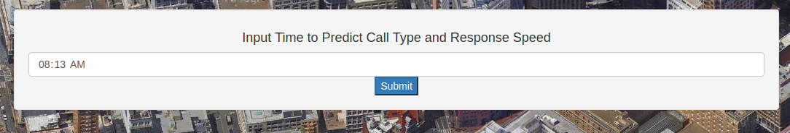

# SFPD-Dispatch
Capital One Software Engineering Summit

<h1 align="center"><a href="http://sfpd-data.herokuapp.com/">SFPD Data Analytics Heroku Web App</a></h1>


<h3 align="center">Example Addresses</h3>

**101 Post Street San Francisco, CA 94108** - Capital One Cafe in Union Square

**420 Montgomery Street San Francisco, CA 94104** - Capital One Residential Bank

**2603 Camino RamonSan Ramon, CA 94583** - Capital One Residential Bank

**999 Van Ness Ave, San Francisco, CA 94109** - The <i>second</i> coolest Tesla showroom in Northern California...

**527 5th St, San Francisco, CA 94107, USA** - An address in SF that has placed *52* Reports within an 11 day period

<h1 align="center">Interesting Facts about the Data Set</h1>


- Only **29.07%** Of Reports are to unique locations

- The remaining **70.93%** are repeated locations

- The average SFPD Response Time is **8 minutes and 4.61 seconds**

- Calls placed from the Zipcode **94127** have an average response time of **45 minutes and 19.51 seconds**

- The response time average for the zipcode **94127** is 5.61 times the San Francisco Average...

- Coincidentally, **94127** has the highest Mean Household Income out of all of the zipcodes in SF ($127,575)

### About the Web App

The web app is hosted using <a href"https://www.heroku.com/">Heroku</a>.

The Backend was done using Python's Flask framework, and in an attempt to make everything as modularized as possible almost everything going on in the backend is done using a REST API.

I first converted the CSV into a list of python dictionaries to make it a little bit easier to work with.  From there, I created a ton of functions in interactions.py that make it easier to filter data.

For instance, the most used function in interactions.py was the following:

```python
def incidentsNearLatLng(point, radius):
	# Returns a list of instances within radius of a long lat point
	dataset = readDataset()
	# Reads the dataset
	values = copy.copy(dataset)
	# This copies that dataset list so nothing is does to this array
	for var in values:
		# Goes through all values in the dataset
		if not checkInRadius((float(var["latitude"]), float(var["longitude"])), point, radius):
			# Checks to see if the value is within the radius
			dataset.remove(var)
			# Removes the value
	return dataset
	# Returns a list of python dictionaries
```

And I used something called the Haversine equation to calculate distances between two long/lat points.  This allowed me to filter out incidents to only show ones that happened nearby.

The data visualization is broken up into 4 parts:

### #1 Primary Map/Visualization

[](#)
<p align="center">Primary Visualization that allows the user to navigate through a map of San Francisco.  Address autocomplete has been implemented using Google's Javascript Map API</p>

[](#)
<p align="center">The user can input an address in San Francisco and the map will move over to center that address's Long/Lat coordinates</p>

[](#)
<p align="center">You can click nearby point to learn details about incidents that have happened nearby</p>

### #2 Reports by Residential Address/Predictions

[](#)
<p align="center">After the user clicks "View Full Report" the web app will open another window showing details surrounding that Long/Lat coordinate.  <b>Note: The background is a satellite view of the address that was inputted.</b></p>

[](#)
<p align="center">This coordinate is <b>NOT</b> a coordinate that's in the Dataset, so it uses nearby instances to make predictions about call priority and response time</p>

[](#)
<p align="center">The user can input a time and the web app will make a prediction about the type of call and response time</p>

[](#)
<p align="center">The predictions are made using nearby incident reports</p>

[](#)
<p align="center">After looking at the incident report, users can either go back to the residental map, view the Github repository, or view the additional data visualizations surrounding the entire dataset</p>

### #3 Data Visualizations

[](#)
<p align="center">Visualization showing average response time for each zip code in San Francisco</p>

[](#)
<p align="center">Visualization showing Mean Household Income for each zip code in San Francisco</p>

[](#)
<p align="center">Visualization showing average distance from a fire department for each zip code in San Francisco</p>

[](#)
<p align="center">Visualization showing frequency of Non-Emergency and Emergency calls to the San Francisco police department</p>

[](#)
<p align="center">After viewing the Data Visualizations, users can go back to the top of the page and click on the large blue button to open the Heatmap</p>

### #4 Heatmap

[](#)
<p align="center">The Heatmap represents the frequency of calls by location in San Francisco</p>


## Most Active Police Destinations

1. (37.77762423892872, -122.39998111124002) - **52 Reports**

2. (37.79267911710725, -122.39685349996866) - **45 Reports**

3. (37.786117211837905, -122.4198542456919) - **44 Reports**

4. (37.78186544733037, -122.41428534642068) - **41 Reports**

5. (37.740332988667284, -122.4664485824384) - **40 Reports**

6. (37.77953108466273, -122.41354254868111) - **38 Reports**

7. (37.78480738867744, -122.41361543826261) - **34 Reports**

8. (37.786409613771546, -122.4080362362708) - **34 Reports**

9. (37.7980449492818, -122.3963670843851) - **34 Reports**

10. (37.777712440431586, -122.41273670742505) - **32 Reports**

Fire Departments:

- 935 Folsom at 5th Street
- 1340 Powell Street at Broadway
- 1067 Post Street at Polk Street
- 449 Mission Rock at 3rd Street
- 1301 Turk Street at Webster Street
- 135 Sanchez Street at Henry Street
- 2300 Folsom Street at 19th Street
- 36 Bluxome Street at 4th Street
- 2245 Jerrold Avenue at Upton Street
- 655 Presidio Avenue at Bush Street
- 3880 26th Street at Church Street
- 1145 Stanyan Street at Grattan Street
- 530 Sansome Street at Washington Street
- 551 26th Avenue at Geary Boulevard
- 1000 Ocean Avenue at Phelan Avenue
- 2251 Greenwich Street at Fillmore Street
- 1295 Shafter Avenue at Ingalls Street
- 1935 32nd Avenue at Ortega Street
- 390 Buckingham Way at Winston Street
- 285 Olympia Way at Clarendon Avenue
- 1443 Grove Street at Broderick Street
- 1290 16th Avenue at Irving Street
- 1348 45th Avenue at Judah Street
- 100 Hoffman Avenue at Alvarado Street
- 3305 3rd Street at Cargo Way
- 80 Digby Street at Addison Street
- 1814 Stockton Street at Greenwich Street
- 299 Vermont Street at 16th Street
- 441 12th Avenue at Geary Boulevard
- 194 Park Street at Holly Park Circle
- 8 Capital Street at Broad Street
- 499 41st Avenue at Geary Boulevard
- Pier 22½, The Embarcadero at Harrison Street
- 109 Oak Street at Franklin Street
- 798 Wisconsin Street at 22nd Street
- 2150 California Street at Laguna Street
- 1091 Portola Drive at Miraloma Drive
- 2155 18th Avenue at Rivera Street
- 1325 Leavenworth Street at Jackson Street
- 2430 San Bruno Avenue at Silver Avenue
- 720 Moscow Street at France Avenue
- 1298 Girard Street at Wilde Avenue
- 800 Avenue I at 10th Street, Treasure Island
- 1415 Evans Avenue at Mendell Street
- 218 Lincoln Blvd at Keyes Avenue


Hospitals in San Francisco:

- 2425 Geary Blvd
- 2425 Geary Blvd
- 1600 Divisadero St
- 1600 Divisadero St
- 3700 California St
- 3700 California St
- 2333 Buchanan St
- 2333 Buchanan St
- 450 Stanyan St
- 450 Stanyan St
- Castro and Duboce Streets
- Castro and Duboce Streets
- 505 Parnassus Avenue
- 505 Parnassus Avenue
- 900 Hyde St
- 900 Hyde St
- 1001 Potrero Ave
- 1001 Potrero Ave
- 3555 Cesar Chavez
- 3555 Cesar Chavez
- 845 Jackson St
- 845 Jackson St
- 1200 El Camino Real
- 1200 El Camino Real
- 350 Hawthorne Ave
